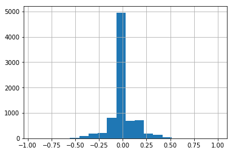
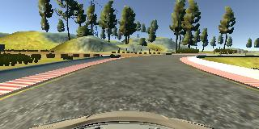
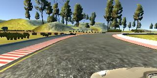
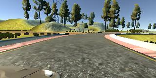
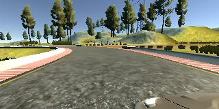
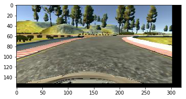
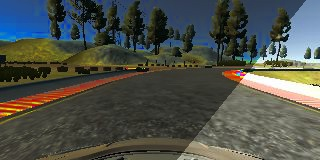

# Behaviorial Cloning Project

## Overview

In this project, you will use what you've learned about deep neural networks and convolutional neural networks to clone driving behavior. You will train, validate and test a model using Keras. The model will output a steering angle to an autonomous vehicle.

We have provided a simulator where you can steer a car around a track for data collection. You'll use image data and steering angles to train a neural network and then use this model to drive the car autonomously around the track.

## Proposed Solution

### Model Architecture

The project lessons recommended a paper from NVIDIA that demonstrated that CNNs are capable of learning how to autonomously drive on roads. The study showed that with less than a hundred hours of driving as input, the network learned how to drive in several different conditions on highways, local and residential roads and in sunny, cloudy or rainy conditions.

It was pretty obvious to me that if the architecture they propposed on the model was good enough for real life application, it should perform well in our simulator as well, so I have decided to use their architecture and focus my effort into the other pieces of the pipeline - mostly on data collection and data augmentation.

For further details please refer to the original paper:
http://images.nvidia.com/content/tegra/automotive/images/2016/solutions/pdf/end-to-end-dl-using-px.pdf

I did a small change to the NVIDIA network and added Batch Norm layers before each convolution, that would not only allow for higher learning rates, but also remove the need for normalizing the images during pre-processing.

Here is the architecture I used:

- Input(160, 320, 3)

Images were cropped to remove the first 30 pixels (removing the sky and trees) and bottom 25 pixels (removing the car hood)

- Cropping (Removed top 30 pixels and bottom 25 pixels)

- Batch Normalization
- Convolution (Kernel: 5x5, Depth: 24, Stride: 2, border: valid)
- Relu

- Batch Normalization
- Convolution (Kernel: 5x5, Depth: 36, Stride: 2, border: valid)
- Relu

- Batch Normalization
- Convolution (Kernel: 5x5, Depth: 48, Stride: 2, border: valid)
- Relu

- Batch Normalization
- Convolution (Kernel: 3x3, Depth: 64, Stride: 1, border: valid)
- Relu

- Batch Normalization
- Convolution (Kernel: 3x3, Depth: 64, Stride: 1, border: valid)
- Relu

- Flatten
- Fully Connected layer (Size: 100, activation: Relu, regularization: 1e-3)
- Fully Connected layer (Size: 50, activation: Relu, regularization: 1e-3)
- Fully Connected layer (Size: 10, activation: Relu, regularization: 1e-3)
- Output (1)

Training parameters:
- Optimizer: Adam
- Learning rate: 1e-3
- Batch size: 128
- Epochs: 10
- Examples per epoch: ~50k images

## Data Collection

Collecting data for behavioral cloning is a lot more complicated than intuitively just driving around the track for a number of laps. The test data has to be carefully curated to display only the behavior you want your model to learn.

I wasted a good amount of time driving around tracks 1 and 2, thinking that I was driving appropriately, only to find out later that my steering angles were not smooth enough and introduced unnecessary noise to the model during training, probably because using a mouse to drive the car around the track doesn't give us smooth steering rates unless you are really careful with your inputs.

At this point I decided to explore the data that was provided by Udacity (I probably should have done this before deciding to get my own data, lesson learned.) I used the provided video.py scrpit to convert images into video to visualize the training dataset and it was a lot better than what I have achieved driving with the mouse.

The dataset had a few laps driven in each direction of track 1, some corrections for when the car deviated from the center of the lane, and more importantly smooth cornering and centered in the track. That really seemed like the appropriate behavior we wanted our car to have, but it was not enough data for the model to learn only from it.

Since driving it myself was already proven not to be the best idea, the only other option I had was to rely on data augmentation. It was also pretty obvious that I should use the images from the side cameras as well, that way our raw dataset was already 3x larger than if we just used the center images.

When using images from the side cameras I adjusted the steering angle by 0.2 radians, as suggested in the lesson material, adding it to the steering angle if the shift was to the left and subtracting if the shift was to the right.

## Data augmentation

The first obvious thing to do with the images was flip it vertically, it was even suggested during the lessons.

The other transformations we could add to the images were lateral translation (to simulate the car being in different positions in the lane), vertical translation (to simulate slopes as we have in track 2) and disturbing the brightness of the image (making it darker or brighter to simulate different lighting conditions).

While searching for some other ideas for data augmentation I came across this nice [post](https://chatbotslife.com/using-augmentation-to-mimic-human-driving-496b569760a9) from Vivek Yadav that also suggested that adding randomly casted shadows to the dataset would help it generalize better.

The pipeline implemented will randomly choose between left, right or center image and with 66% probability apply each augmentation (the only exception was flipping that was applied only 50% of the time).

This approach also takes care of removing the straight line driving bias from our dataset. As you can see on the histogram below, most of our driving for track one is done on straight lines (with steering angle close to 0), but once you start taking left and right images and random translation distortions, these examples become either a correction (making the car go back to the center of the road) or a sharper turn.

### Steering angle of raw dataset

### Augmentation Examples

#### - Original image from center camera:

#### - Original image from left camera:

#### - Original image from right camera:

#### - Vertical flip (p = 50%):
Here we flipped the image along its vertical axis and multiply the steering angle by -1 to reflect the change in the curve direction.

#### - Lateral and vertical translation:
For this step I also had to modify the steering angle of the car based on the strength of the augmentation. I have allowed for the image to move by 60 pixels to the left to the right (the same magnitude between the side cameras and the center camera) and 30 pixels up or down (half of the side movement as vertical shifts are in general smaller than lateral shifts when driving).   

#### - Disturbed brightness:
Initially I disturbed the brightness of the images by 33%, making the images darker or brighter by no more than 33% of the original image, but that was not enough to make the car drive well on track 2. As soon as it entered the first shaded region it drove straight out of the track.

After increasing this limit to 50% the performance ... TBD

#### - Random shadow:
Similarly to the disturbed brightness, we alter the brightness of the image by the same amount (33% and then 50%) but instead of disturbing the whole image, we only add it to a random part of the image. That should allow the model to generalize well and be able to deal with the shadows on Track 2.

## Training and performance on track one

Data augmentation, pre-processing and L2 regularization on the fully connected layers were enough to allow the model to learn how to drive around track one without any issues. There was no evidence of overfitting and the model completed several laps at varying speeds: 9mph, 15mph and 30mph, although the quality of the driving decreased with the  increase of speed, specially on straights were the car would start driving from left to right trying to correct it's position but using too high of a steering input.

The training process was very simple, split the cleaned dataset into training and validation (80/20) and use data augmentation to create 50k images per epoch. I used Adam optimizer so I didn't need to worry about finetuning the learning rate.

A batch size of 128 images was chosen to accommodate the dataset in my GPU memory while also leaving room to perform all the augmentation steps and the model trained for 10 epochs, saving a new version after each epoch so I could easily test the performance for each iteration.

Since the RMSE error isn't really meaningful for this application, I tested all 10 models and chose the one with the best performance - epoch 3 in this case. It was also very disturbing that sometimes just one iteration more than the ideal training time was enough to make the car to run out of the track.

## Track two

Track two proved to be a lot more tricky than track one, the same model that was performing so well on track one could barely start driving on track two, it would try to cross the guard rail on the initial straight and get stuck.

I saw that students from other cohorts had no problems in completing the challenge with just data from the first track and I decided that I was going to follow the same path. That was the beginning of countless hours of tuning and training.

My first guess was that the model was overfitting and learned all the aspects of track one, and was not generalizing well, so I started increasing regularization.

First I slowly increased it only on the fully connected layers, but the performance was getting worse and worse. I tried adding regularization to the convolutional layers as well, and followed the same method of starting small and increase slightly after every frustrated run. At this point the model was performing a lot worse than my initial model on track one.

My second big effort was to increase data augmentation strength, I thought that if my lighting distortions were more intense, it would make it harder for the model to over fit as the images were going to be more different to each other. Those trials were also run for several hours and as i increased the augmentation strength, the performance of the model was getting worse.

At this point I thought: "If regularization is not working, data augmentation is not working, the problem has to be with the model!". After experimenting with a couple of different architectures and not seeing any improvement in results I decided to head to the forums once again to see how other students were able to get around track two with just training data from track one, and I found out that apparently the second track was recently changed and is a lot more challenging than it used to be.

I'm not sure whether just by adding the right data augmentation you could still use just data from track one to go around track two, but after carefully collecting data from a just two laps in track two (one in each direction and this time using a PS4 controller for increased precision in corners), and training for 10 epochs using 50k images per epoch, the model was able to navigate the more challenging track and completed several laps at 12mph without any issues.

## Conclusion and shortcomings

After spending hours in parameter and model tuning and only a few minutes in collecting additional data it became very obvious that the most important part of any model is data. Not only the amount of data, but the quality of the data as well. It is well worth to spend time in the beginning of your project studying your dataset and curating it to extract the most value of it.

Although the model is able to successfully complete both tracks, the jitterness of the steering inputs compromises quality of driving in higher speeds. It's probably possible to fix it by reducing the correction parameter for translated images, but that can have an adverse impact on sharper corner performance.

Another alternative would be to use a filter to smooth the steering inputs before they are sent to the simulator.

A quicker solution to both ideas above was just to modulate the speed of the car in drive.py according to the steering angle. By allowing the speed to vary from 10 to 30 mph depending on current speed and steering angle, I removed the drunk driving behavior and were able to complete track two a lot faster than using a steady 12mph pace, at the cost of increased time to complete track one. The final results can be seeing on the videos.

## References:
[1] [End to End Learning for Self-Driving Cars](http://images.nvidia.com/content/tegra/automotive/images/2016/solutions/pdf/end-to-end-dl-using-px.pdf)

[2] [An augmentation based deep neural network approach to learn human driving behavior](https://chatbotslife.com/using-augmentation-to-mimic-human-driving-496b569760a9)
